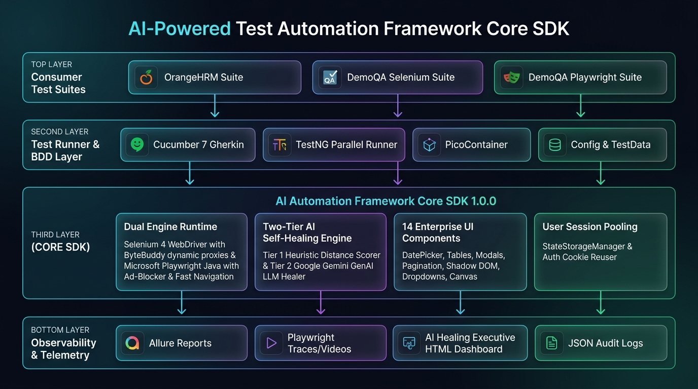

# ⚛️ DemoQA Test Automation Consumer Project (React SPA & Modern UI)

A comprehensive standalone BDD test automation project automating **[DemoQA](https://demoqa.com/)** using the **AI-Powered Test Automation Framework Core SDK** (`com.automation:ai-automation-framework:1.0.0`).

---

## 📋 Table of Contents
1. [Overview & Architecture](#1-overview--architecture)
2. [Complete Automated Test Suites Matrix](#2-complete-automated-test-suites-matrix)
3. [Components Demonstrated](#3-components-demonstrated)
4. [Prerequisites & SDK Installation](#4-prerequisites--sdk-installation)
5. [Running Tests Locally](#5-running-tests-locally)
6. [Docker & Containerized Execution](#6-docker--containerized-execution)
7. [AI Self-Healing & Multi-Provider Setup](#7-ai-self-healing--multi-provider-setup)
8. [Centralized Web Dashboard & Offline HTML Reports](#8-centralized-web-dashboard--offline-html-reports)
9. [Git Auto-Patch & Self-Healing PR Generator](#9-git-auto-patch--self-healing-pr-generator)
10. [Configuration Properties Reference](#10-configuration-properties-reference)
11. [Test Data Management (TDM) Engine](#11-test-data-management-tdm-engine)
12. [Troubleshooting & Frequently Asked Questions (FAQ)](#12-troubleshooting--frequently-asked-questions-faq)

---

## 1. Overview & Architecture

This project automates the entire **DemoQA** application across 6 functional domains:
- **Elements**: Text Box, Check Box, Radio Button, Web Tables (CRUD & Pagination), Buttons, Links, Broken Links/Images, Upload & Download, Dynamic Properties.
- **Forms**: Complete Student Registration Practice Form (Complex React DatePicker, Multi-Autocomplete Tags, Dynamic Radios/Checkboxes, State/City Cascading Dropdowns, and Submission Modal).
- **Alerts, Frame & Windows**: Browser Tabs, Multiple Windows, Iframes, Nested Frames, Modal Dialogs (Small & Large), JavaScript Alerts.
- **Widgets**: Accordion Panels, Multi/Single Autocomplete Tags, DatePicker & DateTime, Range Slider, Progress Bar with Reset, Tabbed Navigation, Tooltip Popovers, Multi-Level Nested Hover Menu, Select Menu.
- **Interactions**: Drag and Drop Sortable, Multi-Selectable Lists and Grids, Resizable Box Constraints, Droppable Target Area, Dragabble Position Offset.
- **Book Store Application**: Catalog Book Search, Book Details Inspection, Return to Store Navigation, Login User Authentication.

All driver management, element waiting, pre-flight validation, and AI healing are inherited directly from the Core SDK in `pom.xml`:

```xml
<dependencies>
    <dependency>
        <groupId>com.automation</groupId>
        <artifactId>ai-automation-framework</artifactId>
        <version>1.0.0</version>
    </dependency>
</dependencies>
```

### 🏛️ Platform Architecture Diagram



### 🔄 Test Execution Lifecycle & AI Self-Healing Flowchart


---

## 2. Complete Automated Test Suites Matrix

| # | Feature File | Target Page URL | Page Object | Tags | Key Capabilities & Scenarios |
| :- | :--- | :--- | :--- | :--- | :--- |
| 1 | **`01_SelectMenu.feature`** | `/select-menu` | `DemoQaSelectMenuPage` | `@SelectMenu`, `@Smoke` | React Select Grouping, Select One Title, Old Style HTML Select, Multi-Select Badges, Standard Cars |
| 2 | **`02_TextBox_Form.feature`** | `/text-box` | `DemoQaTextBoxPage` | `@TextBox`, `@Smoke` | Full Name, Email, Current & Permanent Address JSON form submission & output validation |
| 3 | **`03_RadioAndButtons.feature`** | `/radio-button`, `/buttons` | `DemoQaRadioButtonPage`, `DemoQaButtonsPage` | `@Buttons`, `@Smoke` | Yes / Impressive Radios, Disabled Radio assert, Double Click, Context Right Click, Dynamic Click |
| 4 | **`04_WebTables.feature`** | `/webtables` | `DemoQaWebTablesPage` | `@WebTables`, `@Regression` | Table search, Add new employee modal, Inline Edit record, Delete row, Rows-per-page pagination |
| 5 | **`05_Alerts_Modals.feature`** | `/alerts` | `DemoQaAlertsPage` | `@Alerts`, `@Smoke` | Simple JS Alert, Confirm Box (Accept/Dismiss), Prompt Alert text entry & result assertion |
| 6 | **`06_AI_SelfHealing_Demo.feature`** | `/text-box` | `DemoQaBrokenHealingPage` | `@SelfHealing` | Dual-Tier AI Pre-Flight Self-Healing of broken locators with JSON report generation |
| 7 | **`07_CheckBox.feature`** | `/checkbox` | `DemoQaCheckBoxPage` | `@CheckBox`, `@Smoke` | Expand / Collapse all tree nodes, Toggle Home folder, Desktop / Documents / Downloads assertions |
| 8 | **`08_Links.feature`** | `/links` | `DemoQaLinksPage` | `@Links`, `@Smoke` | Simple & Dynamic tab links, API links (201 Created, 204 No Content, 301, 400, 401, 403, 404) |
| 9 | **`09_BrokenLinksImages.feature`** | `/broken` | `DemoQaBrokenLinksImagesPage` | `@Broken` | `naturalWidth` image rendering validation, broken image detection, 200 vs 500 link navigation |
| 10 | **`10_UploadDownload.feature`** | `/upload-download` | `DemoQaUploadDownloadPage` | `@UploadDownload`, `@Smoke` | File download trigger and file upload path display assertion |
| 11 | **`11_DynamicProperties.feature`** | `/dynamic-properties` | `DemoQaDynamicPropertiesPage` | `@DynamicProperties` | 5-second enable button, color change text (`text-danger`), visible after 5s button |
| 12 | **`12_PracticeForm.feature`** | `/automation-practice-form` | `DemoQaPracticeFormPage` | `@Forms`, `@PracticeForm` | Complete student registration form (Datepicker, Autocomplete, Hobbies, Picture, State/City, Modal) |
| 13 | **`13_BrowserWindows.feature`** | `/browser-windows` | `DemoQaBrowserWindowsPage` | `@AlertsWindows`, `@BrowserWindows` | New Browser Tab switching & heading validation, New Window popup management |
| 14 | **`14_Frames.feature`** | `/frames` | `DemoQaFramesPage` | `@AlertsWindows`, `@Frames` | Switch to iFrame 1 and iFrame 2, assert heading text, return to default content |
| 15 | **`15_NestedFrames.feature`** | `/nestedframes` | `DemoQaNestedFramesPage` | `@AlertsWindows`, `@NestedFrames` | Switch to parent frame -> switch to child iframe inside parent -> default content |
| 16 | **`16_ModalDialogs.feature`** | `/modal-dialogs` | `DemoQaModalDialogsPage` | `@AlertsWindows`, `@ModalDialogs` | Small Modal & Large Modal trigger, header title, body text inspection, and close |
| 17 | **`17_Accordian.feature`** | `/accordian` | `DemoQaAccordianPage` | `@Widgets`, `@Accordian` | Section 1 default expanded, Section 2 & 3 toggle, collapsible animation assertion |
| 18 | **`18_AutoComplete.feature`** | `/auto-complete` | `DemoQaAutoCompletePage` | `@Widgets`, `@AutoComplete` | Multi-value color tags creation and removal, Single color autocomplete input |
| 19 | **`19_DatePicker.feature`** | `/date-picker` | `DemoQaDatePickerPage` | `@Widgets`, `@DatePicker` | Select Date calendar month/year/day picker, Date & Time picker slot selection |
| 20 | **`20_Slider.feature`** | `/slider` | `DemoQaSliderPage` | `@Widgets`, `@Slider` | Interactive range slider dragging (50, 75, 90) and input value box sync |
| 21 | **`21_ProgressBar.feature`** | `/progress-bar` | `DemoQaProgressBarPage` | `@Widgets`, `@ProgressBar` | Start progress bar, wait until 100% completion, assert complete state, reset button |
| 22 | **`22_Tabs.feature`** | `/tabs` | `DemoQaTabsPage` | `@Widgets`, `@Tabs` | Switch between What, Origin, Use tabs, assert panel content, assert disabled More tab |
| 23 | **`23_ToolTips.feature`** | `/tool-tips` | `DemoQaToolTipsPage` | `@Widgets`, `@ToolTips` | Hover action on button and textfield, verify dynamic popover tooltip text |
| 24 | **`24_Menu.feature`** | `/menu` | `DemoQaMenuPage` | `@Widgets`, `@Menu` | Multi-tier nested hover navigation (Main Item 2 -> SUB SUB LIST -> Sub Sub Item 1/2) |
| 25 | **`25_Sortable.feature`** | `/sortable` | `DemoQaSortablePage` | `@Interactions`, `@Sortable` | Drag and drop list reordering and position assertion |
| 26 | **`26_Selectable.feature`** | `/selectable` | `DemoQaSelectablePage` | `@Interactions`, `@Selectable` | Vertical list multi-selection and Grid box item selection with active styling |
| 27 | **`27_Resizable.feature`** | `/resizable` | `DemoQaResizablePage` | `@Interactions`, `@Resizable` | Drag resize handle with min/max box boundary verification |
| 28 | **`28_Droppable.feature`** | `/droppable` | `DemoQaDroppablePage` | `@Interactions`, `@Droppable` | Drag and drop draggable onto target drop area, assert "Dropped!" status |
| 29 | **`29_Dragabble.feature`** | `/dragabble` | `DemoQaDragabblePage` | `@Interactions`, `@Dragabble` | Coordinate offset dragging and element position updates |
| 30 | **`30_BookStore.feature`** | `/books` | `DemoQaBookStorePage` | `@BookStore`, `@Smoke` | Search catalog by title ("Git Pocket Guide"), view Book Details (Author, Publisher), back to store |
| 31 | **`31_Login.feature`** | `/login` | `DemoQaLoginPage` | `@BookStore`, `@Login` | Submit invalid user authentication credentials and assert rejection message |

---

## 3. Components Demonstrated

### 1. `SelectComponent` (Universal React / Angular / HTML Dropdowns)
```java
// Select from React-Select Option Group container
selectValueDropdown.selectByText("Group 2, option 1");

// Multi-select multiple badges
multiselectDropdown.selectMultipleByText(List.of("Green", "Blue"));

// Standard HTML select
oldStyleSelect.selectByVisibleText("Aqua");
```

### 2. `AccordionComponent`
```java
accordion.expandSection("Where does it come from?");
boolean isExpanded = accordion.isSectionExpanded("Where does it come from?");
```

### 3. `TabsComponent`
```java
tabs.selectTab("Origin");
boolean isActive = tabs.isTabActive("Origin");
```

### 4. `ModalComponent`
```java
modal.waitForOpen(5);
String title = modal.getTitle();
modal.close();
```

---

## 4. Prerequisites & SDK Installation

### System Requirements
- **Java JDK**: JDK 17 LTS (`java -version`)
- **Apache Maven**: 3.8.0+ (`mvn -version`)
- **Google Chrome**: Desktop browser (latest version)

### 📦 Core SDK Installation & Distribution

#### Option 1: GitHub Packages (Cloud Distribution)
Configure your `~/.m2/settings.xml` (Windows: `C:\Users\<user>\.m2\settings.xml`):
```xml
<settings>
  <servers>
    <server>
      <id>github</id>
      <username>YOUR_GITHUB_USERNAME</username>
      <password>${env.GITHUB_TOKEN}</password>
    </server>
  </servers>
</settings>
```
Declare the repository and dependency in `pom.xml`:
```xml
<repositories>
    <repository>
        <id>github</id>
        <name>GitHub Packages</name>
        <url>https://maven.pkg.github.com/Parvez414/ai-powered-test-automation-platform</url>
    </repository>
</repositories>

<dependencies>
    <dependency>
        <groupId>com.automation</groupId>
        <artifactId>ai-automation-core</artifactId>
        <version>1.0.0</version>
    </dependency>
</dependencies>
```

#### Option 2: Local JAR Installation (Offline / Air-Gapped)
This project includes the pre-packaged SDK JAR in [`core_sdk_jar/`](core_sdk_jar/).

To install this JAR into your local Maven cache (`~/.m2/repository`):

##### Linux / macOS / Bash:
```bash
mvn install:install-file \
  -Dfile=core_sdk_jar/ai-automation-framework-1.0.0.jar \
  -DgroupId=com.automation \
  -DartifactId=ai-automation-framework \
  -Dversion=1.0.0 \
  -Dpackaging=jar
```

##### Windows (PowerShell / Command Prompt):
```powershell
mvn install:install-file "-Dfile=core_sdk_jar/ai-automation-framework-1.0.0.jar" "-DgroupId=com.automation" "-DartifactId=ai-automation-framework" "-Dversion=1.0.0" "-Dpackaging=jar"
```

Once installed, Maven will resolve all SDK classes, components, driver utilities, and test helpers seamlessly.

---

## 5. Running Tests Locally

```bash
# 1. Run all DemoQA scenarios
mvn test

# 2. Run specifically the Smoke test suite
mvn test -Dtest=DemoQaTestRunner "-Dcucumber.filter.tags=@Smoke"

# 3. Run in Headless mode (Fast CI/CD execution)
mvn test -Dheadless=true

# 4. Run across multiple threads in parallel
mvn test -Dthread.count=4

# 5. Run specific modules by Cucumber tag
mvn test "-Dcucumber.filter.tags=@Elements"
mvn test "-Dcucumber.filter.tags=@Forms"
mvn test "-Dcucumber.filter.tags=@AlertsWindows"
mvn test "-Dcucumber.filter.tags=@Widgets"
mvn test "-Dcucumber.filter.tags=@Interactions"
mvn test "-Dcucumber.filter.tags=@BookStore"

# 6. Run on Cloud Platforms (BrowserStack, SauceLabs, LambdaTest)
mvn test -Dexecution.mode=remote -Dcloud.provider=browserstack -Dcloud.username=MY_USER -Dcloud.accesskey=MY_KEY
```

---

## 6. Docker & Containerized Execution

```bash
# Spin up isolated Linux container, execute tests in headless Chrome, and map reports to host:
docker-compose run --rm demoqa-test-runner

# Run specific tags in Docker:
docker-compose run --rm demoqa-test-runner "-Dcucumber.filter.tags=@Smoke"
```

---

## 7. AI Self-Healing & Multi-Provider Setup

The AI-Powered Automation Framework Core SDK features an enterprise-grade **Multi-Provider AI Self-Healing Engine** that dynamically analyzes broken locators, scans DOM attributes, and repairs tests in real time. It supports offline heuristics, cloud AI models, enterprise private endpoints, and on-premise air-gapped LLMs.

### Supported AI Providers & Modes

Configure `ai.healing.provider` in [`src/test/resources/config/config.properties`](src/test/resources/config/config.properties):

| Provider Mode | Description | Key Configuration / Env Variables |
| :--- | :--- | :--- |
| **`hybrid`** *(Default)* | Fast offline heuristic first; escalates to active AI LLM provider if needed | Configured AI API key or local LLM |
| **`heuristic`** | Offline DOM heuristics (0 latency, 0 cost, rule-based) | None (100% offline) |
| **`gemini`** | Google Gemini LLM with heuristic fallback | `ai.gemini.api.key` / `GEMINI_API_KEY` |
| **`openai`** | OpenAI models (`gpt-4o`, `gpt-4o-mini`) | `ai.openai.api.key` / `OPENAI_API_KEY` |
| **`azure_openai`** | Corporate Azure OpenAI private enterprise endpoint | `ai.azure.openai.endpoint`, `ai.azure.openai.api.key` |
| **`claude`** | Anthropic Claude models (`claude-3-5-haiku`, `claude-3-5-sonnet`) | `ai.claude.api.key` / `ANTHROPIC_API_KEY` |
| **`ollama`** | Local / Air-Gapped LLM (e.g. `deepseek-r1`, `llama3`, `qwen2.5`) | `ai.ollama.base.url` (e.g. `http://localhost:11434`) |
| **`auto`** | Auto-detects the first configured and responsive AI provider | Any configured provider |

### Multi-Provider Configuration in `config.properties`

```properties
# ------------------------------------------------------------------------------
# 4. Multi-Provider AI Self-Healing Engine Settings
# ------------------------------------------------------------------------------
# Master switch for AI Self-Healing
ai.healing.enabled=true

# AI Healing Mode / Provider:
# "hybrid" (default), "heuristic", "gemini", "openai", "azure_openai", "claude", "ollama", "auto"
ai.healing.provider=hybrid

# Optional failover secondary provider if primary LLM fails (e.g., "ollama", "claude")
ai.provider.fallback=

# Dynamic runtime healing for elements that break mid-interaction
ai.runtime.healing.enabled=true

# Minimum confidence threshold (0.50 to 1.00)
ai.healing.confidence.threshold=0.70

# 1. Google Gemini API Settings (or GEMINI_API_KEY environment variable)
ai.gemini.api.key=
ai.gemini.model=gemini-3.6-flash
ai.gemini.temperature=0.1
ai.gemini.timeout.seconds=30

# 2. OpenAI API Settings (or OPENAI_API_KEY environment variable)
ai.openai.api.key=
ai.openai.model=gpt-4o-mini
ai.openai.timeout.seconds=20

# 3. Azure OpenAI API Settings (or AZURE_OPENAI_KEY environment variable)
ai.azure.openai.endpoint=
ai.azure.openai.api.key=
ai.azure.openai.deployment.name=gpt-4o
ai.azure.openai.api.version=2024-02-15-preview

# 4. Anthropic Claude API Settings (or ANTHROPIC_API_KEY environment variable)
ai.claude.api.key=
ai.claude.model=claude-3-5-haiku-20241022
ai.claude.timeout.seconds=20

# 5. Local / Air-Gapped Ollama Settings (100% Offline / Zero Cost)
ai.ollama.base.url=http://localhost:11434
ai.ollama.model=deepseek-r1:8b
ai.ollama.timeout.seconds=30
```

---

## 8. Centralized Web Dashboard & Offline HTML Reports

- **Interactive Standalone HTML Report**: `target/ai-dashboard/index.html`
- **AI Element Healing History**: `target/element-healing-history.json`
- **Step & Failure Screenshots**: `target/screenshots/`
- **Allure Interactive Report**: `mvn allure:serve`
- **Live Telemetry Hub**: Automatically stream test and self-healing telemetry to the Centralized Web Portal (Port `8080`):
  ```properties
  ai.telemetry.enabled=true
  ai.telemetry.url=http://localhost:8080/api/telemetry/report
  ```

---

## 9. Git Auto-Patch & Self-Healing PR Generator

The SDK includes automated locator patching that can update Java Page Object source files and generate Git branches / PRs for team review:

```properties
# Automatically patch broken locators in Java Page Object files and create Git branches
ai.autopatch.enabled=false
ai.autopatch.auto.branch=true
ai.autopatch.branch.prefix=ai-heal/patch-
ai.autopatch.git.commit=true
ai.autopatch.create.pr=false
```

---

## 10. Configuration Properties Reference

Comprehensive configuration options available in [`src/test/resources/config/config.properties`](src/test/resources/config/config.properties):

| Category | Property Key | Default / Sample | Description |
| :--- | :--- | :--- | :--- |
| **Browser & Execution** | `browser` | `chrome` | Target browser (`chrome`, `firefox`, `edge`) |
| | `headless` | `true` | Headless execution mode for CI/CD |
| | `execution.mode` | `local` | `local` or `remote` (Docker / Selenium Grid / Cloud) |
| | `thread.count` | `3` | Parallel thread execution count |
| | `environment` | `qa` | Active environment configuration (`dev`, `qa`, `staging`, `prod`) |
| | `test.retry.count` | `1` | Retry count for flaky scenarios |
| | `execution.delay.ms` | `300` | Pacing delay between browser actions in ms |
| **Timeouts** | `timeout.explicit` | `20` | Explicit wait timeout in seconds |
| | `timeout.pageload` | `60` | Page load timeout in seconds |
| | `timeout.polling.ms` | `500` | Polling interval in ms |
| **AI Self-Healing** | `ai.healing.enabled` | `true` | Master switch for AI Self-Healing |
| | `ai.healing.provider` | `hybrid` | Provider mode: `hybrid`, `heuristic`, `gemini`, `openai`, `azure_openai`, `claude`, `ollama`, `auto` |
| | `ai.provider.fallback` | `gemini` | Optional secondary failover provider |
| | `ai.runtime.healing.enabled` | `true` | Dynamic mid-interaction runtime locator healing |
| | `ai.heuristic.escalation.threshold` | `0.70` | Confidence threshold to escalate to LLMs |
| **Telemetry & Reporting** | `ai.telemetry.enabled` | `true` | Live telemetry streaming to Web Portal |
| | `ai.telemetry.url` | `http://localhost:8080/api/telemetry/report` | Centralized telemetry endpoint URL |
| **Git Auto-Patch** | `ai.autopatch.enabled` | `false` | Automatic Page Object source patching |
| | `ai.autopatch.auto.branch` | `true` | Create new branch for healed locators |

---

## 11. Test Data Management (TDM) Engine

This project uses the Core SDK's zero-boilerplate Test Data Management engine:

### 1. Dynamic JSON Dot-Path Queries (Zero Java Model Classes)
Query any test dataset located under `src/test/resources/data/*.json` using fluent dot-notation without writing Java POJO/DTO mapping classes:
```java
import com.automation.data.TestData;
import com.automation.data.TestDataManager;

// Load a dataset object
TestData studentData = TestDataManager.getData("student-registration.standardStudent");
String firstName = studentData.getString("firstName");
String email = studentData.getString("email");
int age = studentData.getInt("age");

// Or query directly with dot-paths
String state = TestDataManager.getString("student-registration.standardStudent.address.state");
```

### 2. Dynamic Synthetic Data Generation
Prevent data duplication and test collision during parallel test runs:
```java
import com.automation.data.DataGenerator;

String name = DataGenerator.fullName();          // e.g. "Sophia Vance"
String email = DataGenerator.uniqueEmail();       // e.g. "user_1724678@example.com"
String phone = DataGenerator.phoneNumber();       // e.g. "555-019-2834"
```

### 3. Thread-Safe Scenario Context
Pass runtime dynamic test data across Cucumber step definitions safely:
```java
import com.automation.data.ScenarioContext;

// Store in Step 1
ScenarioContext.set("STUDENT_NAME", studentName);

// Retrieve in Step 2
String name = ScenarioContext.getString("STUDENT_NAME");
```

---

## 12. Troubleshooting & Frequently Asked Questions (FAQ)

### Q1: `NoSuchElementException` occurs and AI self-healing does not trigger.
* **Resolution**: The SDK only heals elements that are wrapped with `register()` inside a class extending `BasePage`. Ensure your element is registered:
  ```java
  public PageElement searchBox = register("searchBox", "Search input field", By.id("search"));
  ```
  Also verify that `ai.healing.enabled=true` in `config.properties`.

### Q2: How to handle elements obscured by fixed footer ads or banner overlays in DemoQA?
* **Resolution**: The Core SDK's `ElementActions.click()` and `BasePage.click()` automatically attempt regular Selenium clicks, catch overlay intercepts, scroll the element into view via JavaScript, and fall back to `JavaScriptUtils.clickElement()` if an obstruction is detected.

### Q3: Why does `iframe` or `nestedframe` element lookup fail?
* **Resolution**: Always switch into the iframe before locating child elements, and return to default content when finished:
  ```java
  getDriver().switchTo().frame("frame1");
  // Interact with frame elements
  getDriver().switchTo().defaultContent();
  ```

### Q4: How do I access Shadow DOM custom elements?
* **Resolution**: Standard `By.xpath()` cannot cross shadow boundaries. Use `WebComponent`:
  ```java
  WebComponent customCard = initComponent(WebComponent.class, By.cssSelector("custom-card"));
  WebElement shadowBtn = customCard.pierceShadow("button.action-btn");
  shadowBtn.click();
  ```

### Q5: How do I test AI self-healing behavior deliberately?
* **Resolution**: Run the included self-healing feature suite:
  ```bash
  mvn test -Dcucumber.filter.tags="@SelfHealing"
  ```
  Inspect `target/ai-dashboard/index.html` and `target/element-healing-history.json` to verify the healed selector and confidence score.
